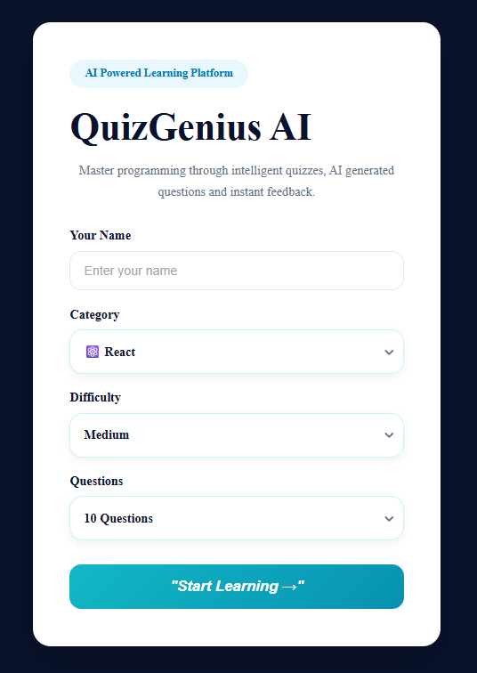
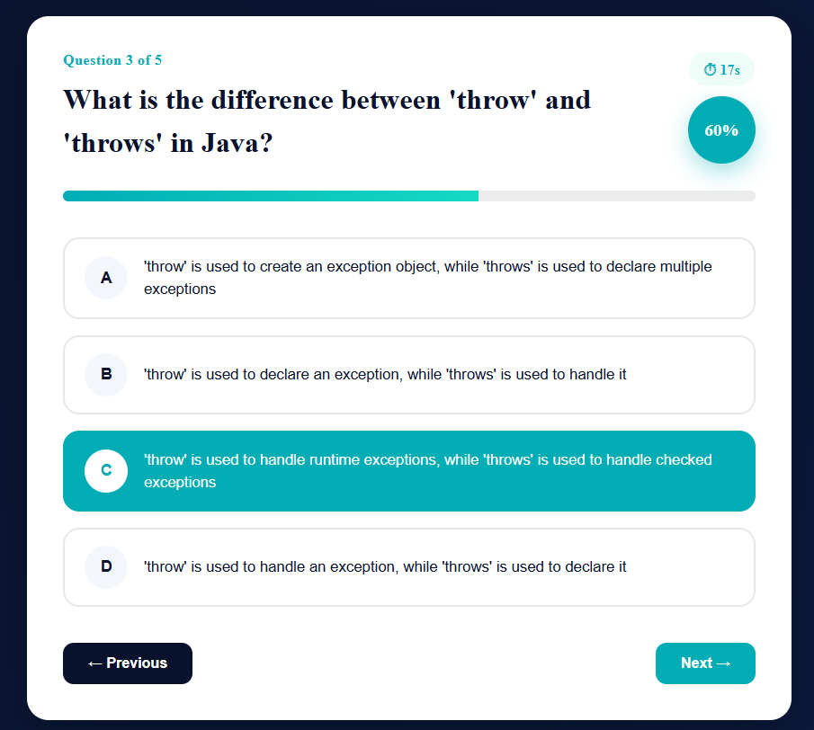
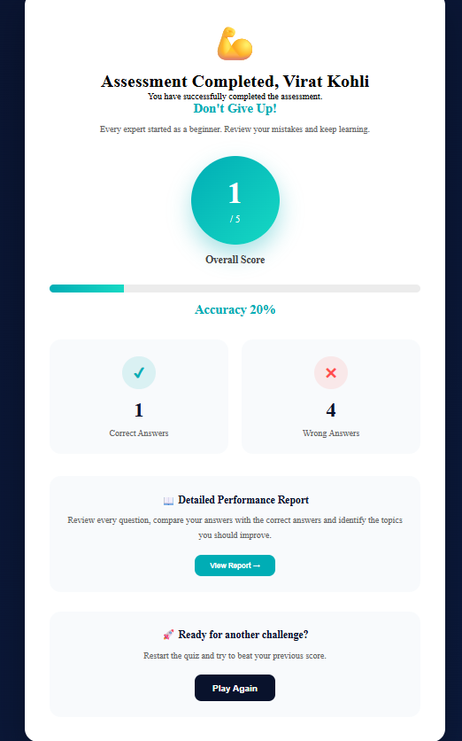

# 🚀 QuizGenius AI

> AI Powered Quiz Generation Platform built with **React, Spring Boot and Groq AI**.



## 📌 Overview

QuizGenius AI is a full-stack AI-powered quiz application that dynamically generates programming quizzes using Large Language Models (Groq AI).

Users can select a programming topic, choose the difficulty level, specify the number of questions, and instantly receive AI-generated multiple-choice questions. The platform also provides timed assessments, automatic scoring, detailed performance reports, and an anti-cheating mechanism for a realistic assessment experience.

---

## ✨ Features

### 🤖 AI Generated Questions

- Generate quizzes instantly using Groq AI
- No hardcoded question bank
- Fresh questions generated every attempt

### 📚 Multiple Categories

- React
- Java
- Spring Boot
- JavaScript
- HTML
- CSS
- SQL

### 🎯 Difficulty Levels

- Easy
- Medium
- Hard

### 📝 Custom Quiz Length

- 5 Questions
- 10 Questions
- 15 Questions
- 20 Questions

### ⏱ Assessment Mode

- Countdown timer
- Question locking after submission
- Progress indicator
- Auto score calculation

### 📊 Performance Report

- Overall score
- Accuracy percentage
- Correct & Wrong answers
- Question review page

### 🔒 Anti Cheating

- Browser navigation detection
- Automatic assessment submission
- Prevent answer modification after locking

---

# 🏗 Architecture

```
React Frontend
       │
       ▼
Spring Boot REST API
       │
       ▼
Groq AI API
       │
       ▼
AI Generated Questions
```

---

# 🛠 Tech Stack

### Frontend

- React
- Vite
- React Router
- Axios
- React Select
- CSS3

### Backend

- Spring Boot
- Java 21
- REST API
- Maven

### AI

- Groq API
- Llama Model

### Deployment

- GitHub Pages
- Render
- GitHub Actions
- Docker

---

# 📷 Screenshots

## Landing Page


---

## Quiz Assessment



---

## Results



---

# 🚀 Live Demo

### Frontend

```
https://farhan2804.github.io/quizapp/
```

### Backend

```
Deployed In Render
```

---

# ⚙ Installation

## Clone Repository

```bash
git clone https://github.com/yourusername/quizapp.git
```

---

## Frontend

```bash
cd frontend
npm install
npm run dev
```

Runs on

```
http://localhost:5173
```

---

## Backend

```bash
cd backend
./mvnw spring-boot:run
```

Runs on

```
http://localhost:8080
```

---

# 🔑 Environment Variables

Create:

```
application.properties
```

```properties
groq.api.key=YOUR_GROQ_API_KEY
```

---

# 📂 Project Structure

```
quizapp
│
├── frontend
│   ├── src
│   ├── public
│   └── package.json
│
├── backend
│   ├── src
│   ├── pom.xml
│   └── Dockerfile
│
└── README.md
```

---

# 📌 Future Enhancements

- AI explanation for every answer
- Leaderboard
- Authentication
- User dashboard
- Quiz history
- PDF report generation
- Dark mode
- Voice based quiz
- Certificate generation

---

# ⭐ Highlights

- AI Powered Question Generation
- Full Stack Architecture
- REST API Integration
- Responsive UI
- Dockerized Backend
- GitHub Actions CI/CD
- Render Deployment
- GitHub Pages Deployment

---

# 👨‍💻 Author

**Farhan Mahmood**

If you found this project interesting, consider giving it a ⭐ on GitHub.